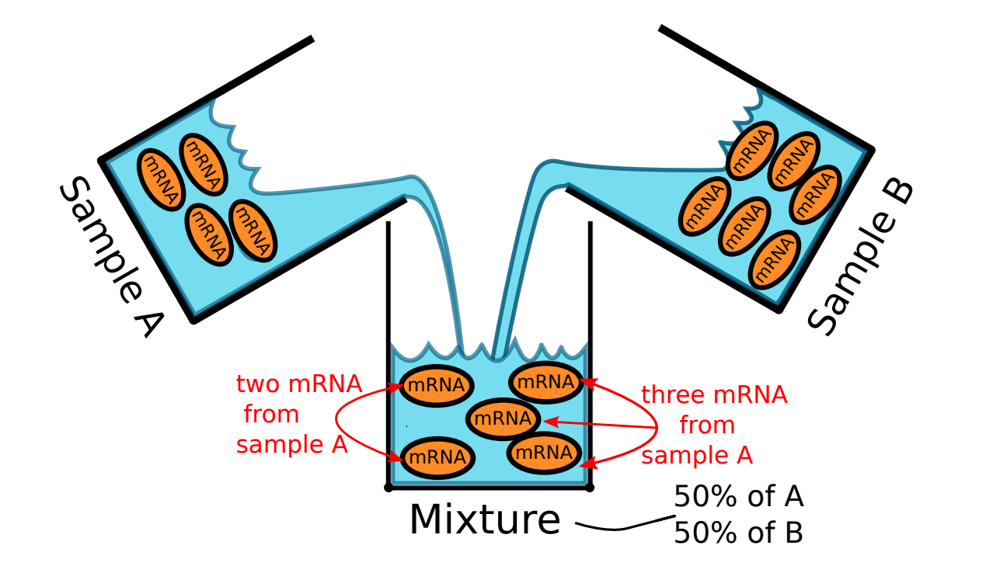

# hspe: hybrid-scale proportions estimation
## a method for cell-type deconvolution

## Software

**hspe** is an R package for cell type deconvolution.

* The **R package** is available [here](hspe_0.1.tar.gz).

### Vignettes

* An example of how to hspe is available here [here](vign/basic-deconvolution.md) ([html](vign/basic-deconvolution.html) [rmd](vign/basic-deconvolution.Rmd))

## Papers

### 1. "The Role of Scale in the Estimation of Cell-type Proportions" (Pre-print)

* Our **new pre-print** on the role of scale in cell-type deconvolution is accessible [here](https://www.biorxiv.org/content/10.1101/857805v1)

* Our **docker image** for reproducing the analysis in paper can be found [here](https://hub.docker.com/r/gjhunt/hybriddeconv).
