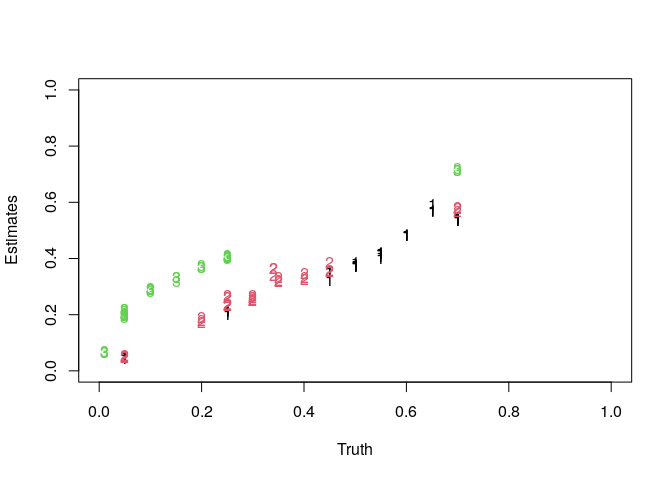

In this vignette we will deconvolve a simple dataset using “hspe.”

The Data
========

In this vignette we will work through a simple example of deconvolving
cell type proportions from DNA microarray data. We work with a data set
created from rats and introduced by [Shen-Orr et
al](https://www.nature.com/nmeth/journal/v7/n4/abs/nmeth.1439.html).
This is available on GEO with accession
[GSE19830](https://www.ncbi.nlm.nih.gov/geo/query/acc.cgi?acc=GSE19830).
The data set we will work with is a subset of the Shen-Orr data and is
included in the `hspe` package under the name `shen_orr_ex`. More
information about the data set is available as part of the `R` help,
`?shen_orr_ex`. First, load up the data set.

    library('hspe')
    names(shen_orr_ex)

    ## [1] "data"       "annotation" "name"

In this data set, rat brain, liver and lung cells have been mixed
together in various proportions. The resulting mixtures were analyzed
with DNA microarrays. The mixing proportions are encoded in the mixture
matrix

    head(shen_orr_ex$annotation$mixture)

    ##           Liver Brain Lung
    ## GSM495209     1     0    0
    ## GSM495210     1     0    0
    ## GSM495211     1     0    0
    ## GSM495212     0     1    0
    ## GSM495213     0     1    0
    ## GSM495214     0     1    0

Each row of this matrix is a sample and each column gives the mixing
proportions of the cell types in each sample.

The RMA-summarized gene expression data generated as part of the
Shen-Orr experiment is accessible under `data$log`:

    Y <- shen_orr_ex$data$log
    Y[1:4,1:4]

    ##           X1367566_at X1367568_a_at X1367570_at X1367584_at
    ## GSM495209    3.396192      7.685769    5.722330    6.628653
    ## GSM495210    2.882626      7.759002    6.005583    6.771917
    ## GSM495211    3.072980      7.598871    5.741630    6.564820
    ## GSM495212    3.168440      7.209959    6.396841    7.040779

Each row is a different individual and each column is a particular gene.
The values of the matrix are log2 RMA-summarized gene
expressions.

Arguments
=========

The arguments to hspe can be grouped as follows:

1.  gene expression data input: Y, references, and pure\_samples
2.  marker gene controls: n\_markers, markers and marker\_method
3.  data scaling control: inv\_scale and fit\_scale for making sure the
    data is on the right scale for hspe

Other arguments to hspe may be found in the help documentation

    ?hspe

1. Y, references, and pure\_samples
===================================

In order to deconvolve gene expression data from mixture samples hspe
requires references of the cell-types to be deconvolved. The mixture
gene expressions and reference gene expressions are given to hspe using
the arguments Y, references, and pure\_samples.

Consider, again, our data from [Shen-Orr et
al](https://www.nature.com/nmeth/journal/v7/n4/abs/nmeth.1439.html) as
an example. For speed, we’re going to subset to a very small number of
genes:

    data = shen_orr_ex$data$log[,c(1:10,201:210,401:410)]
    mixture_proportions = shen_orr_ex$annotation$mixture

looking at the mixture proportions we can see that the first nine
samples are pure reference samples of the three cell types and the
remaining samples are mixture samples of the cell types

    mixture_proportions

    ##           Liver Brain Lung
    ## GSM495209  1.00  0.00 0.00
    ## GSM495210  1.00  0.00 0.00
    ## GSM495211  1.00  0.00 0.00
    ## GSM495212  0.00  1.00 0.00
    ## GSM495213  0.00  1.00 0.00
    ## GSM495214  0.00  1.00 0.00
    ## GSM495215  0.00  0.00 1.00
    ## GSM495216  0.00  0.00 1.00
    ## GSM495217  0.00  0.00 1.00
    ## GSM495218  0.05  0.25 0.70
    ## GSM495219  0.05  0.25 0.70
    ## GSM495220  0.05  0.25 0.70
    ## GSM495221  0.70  0.05 0.25
    ## GSM495222  0.70  0.05 0.25
    ## GSM495223  0.70  0.05 0.25
    ## GSM495224  0.25  0.70 0.05
    ## GSM495225  0.25  0.70 0.05
    ## GSM495226  0.25  0.70 0.05
    ## GSM495227  0.70  0.25 0.05
    ## GSM495228  0.70  0.25 0.05
    ## GSM495229  0.70  0.25 0.05
    ## GSM495230  0.45  0.45 0.10
    ## GSM495231  0.45  0.45 0.10
    ## GSM495232  0.45  0.45 0.10
    ## GSM495233  0.55  0.20 0.25
    ## GSM495234  0.55  0.20 0.25
    ## GSM495235  0.55  0.20 0.25
    ## GSM495236  0.50  0.30 0.20
    ## GSM495237  0.50  0.30 0.20
    ## GSM495238  0.50  0.30 0.20
    ## GSM495239  0.55  0.30 0.15
    ## GSM495240  0.55  0.30 0.15
    ## GSM495241  0.55  0.30 0.15
    ## GSM495242  0.50  0.40 0.10
    ## GSM495243  0.50  0.40 0.10
    ## GSM495244  0.50  0.40 0.10
    ## GSM495245  0.60  0.35 0.05
    ## GSM495246  0.60  0.35 0.05
    ## GSM495247  0.60  0.35 0.05
    ## GSM495248  0.65  0.34 0.01
    ## GSM495249  0.65  0.34 0.01
    ## GSM495250  0.65  0.34 0.01

We want to use these reference samples to deconvolve the remaining
mixture samples. This can be done in a couple of ways:

1.  We can provide Y and pure\_samples to hspe. Here Y will be the
    combined matrix of reference and mixture samples and pure\_samples
    will tell hspe which samples (rows of Y) are reference samples and
    (by elimination) which samples are mixture samples we wish to
    deconvolve.

<!-- -->

    pure_samples = list(Liver=c(1,2,3),Brain=c(4,5,6),Lung=c(7,8,9))
    out = hspe(Y=data, pure_samples = pure_samples,optim_opts=list(pkg="nloptr"))

We can get the estiamtes by accessing the “estimates” property of the
result, and plot them:

    true_proportions = mixture_proportions[-(1:9),]
    matplot(true_proportions,out$estimates, xlim = c(0,1),ylim=c(0,1),xlab="Truth",ylab="Estimates")

1.  We can instead split the data into Y as just the matrix of mixture
    samples and references as the matrix of reference expressions.

<!-- -->

    mixture_samples = data[-(1:9),]
    reference_samples = data[1:9,]

    out = hspe(Y=mixture_samples, reference=reference_samples,pure_samples = pure_samples)

    matplot(true_proportions,out$estimates, xlim = c(0,1),ylim=c(0,1),xlab="Truth",ylab="Estimates")

Now the variable pure\_samples tells hspe to which cell type each of the
the rows of the references matrix corresponds to.

In this example we still needed the variable pure\_samples because our
reference expression matrix contained multiple reference profiles for
each cell type. Often one only has a reference expression matrix with
one (typically average) expression profile per cell type. In this case
we don’t need the pure\_samples argument:

    ref_reduced = t(sapply(pure_samples,function(x)colMeans(reference_samples[x,,drop=FALSE])))

    out = hspe(Y=mixture_samples, reference=ref_reduced)

    matplot(true_proportions,out$estimates, xlim = c(0,1),ylim=c(0,1),xlab="Truth",ylab="Estimates")

2. n\_markers, markers and marker\_method
=========================================

Central to hspe is finding marker genes for each cell type. Markers may
either be given explicitly to hspe by the user or they may be left up to
hspe itself to determine the marker genes automatically.

Letting hspe determine the marker genes.
----------------------------------------

If we do not specify the argument markers then hspe automatically
determines marker genes:

    out = hspe(Y=mixture_samples, references = ref_reduced)

we can change the way that hspe finds marker genes using the
marker\_method argument:

    out = hspe(Y=mixture_samples, references = ref_reduced,marker_method = "diff")

the default is to use “ratio”. More options may be found in the R help
documentation.

The argument n\_markers specifies how many marker genes to use. If
unspecified then hspe uses the top 10% of genes (as ranked according to
marker\_method) as markers.

    out$n_markers

    ## Liver Brain  Lung 
    ##     1     1     1

The number of marker genes can be explicitly specified by setting
n\_markers:

    out = hspe(Y=mixture_samples, references = ref_reduced,marker_method = "diff",n_markers=3)

    out$n_markers

    ## [1] 3 3 3

if just a single integer is specified then all genes us that number of
marker genes. Alternatively we can specify a vector of integers to
specify a number of marker genes individually for each cell type:

    out = hspe(Y=mixture_samples, references = ref_reduced,marker_method = "diff",n_markers=c(1,2,3))

    out$n_markers

    ## [1] 1 2 3

we can also, in a similar fashion, pass a percentage (or vector of
percentages) to n\_markers which will then use that percentage of the
ranked marker genes for each cell type:

    out = hspe(Y=mixture_samples, references = ref_reduced,marker_method = "diff",n_markers=.075)

    out$n_markers

    ## [1] 1 1 1

    out = hspe(Y=mixture_samples, references = ref_reduced,marker_method = "diff",n_markers=c(.1,.15,.05))

    out$n_markers

    ## [1] 1 1 1

Specifying the marker genes explicitly.
---------------------------------------

Instead of letting hspe determine the marker genes we can instead
explicitly pass a list of markers to hspe specifying the marker genes,

    marker_genes = list(c(1,2,3),
                        c(4,5,6),
                        c(7,8,9))

    out = hspe(Y=mixture_samples, references = ref_reduced,markers=marker_genes)
    out$n_markers

    ## [1] 3 3 3

the format of the list is precisely the same format as returned in the
markers element of the output of hspe, that is, a list of vectors of
column indicies of *Y* that are markers of each of the cell types. The
elements of the list correspond one to each cell type in the same order
specified either in elements of pure\_samples or by the rows of
references. The argument of n\_markers can be used in the same way to
subset the markers if desired.

How hspe finds markers
----------------------

hspe finds the marker genes by using the find\_markers function.

    mrkrs = find_markers(Y=mixture_samples, references = ref_reduced)
    names(mrkrs)

    ## [1] "L"  "V"  "M"  "sM"

which returns a list with four elements L which contains all genes
putatively assigned to a cell type they mark, V which contains the
ranking values by which the elements of L are ordered, M and sM which
are the matrix and sorted matrix used to create V and L.

We can pass either the entire list or just the L list to hspe as markers
and re-create how hspe automatically chooses markers:

    out = hspe(Y = mixture_samples,references = ref_reduced,markers=mrkrs,n_markers=.1)

scaling options: supplying the correct scale data to hspe
=========================================================

Notice that we have been working with log2-scale gene expressions. If
not set by the user, hspe assumes log2 transformed expressions. However
we may choose to work with other transformations of gene expressions. In
this case, one needs to tell hspe how to transform this data back to the
linear-scale. This is provided to the argument “inv\_scale”.

Let us artificially create linear-scale gene expression data by un-doing
the log2 transformation applied:

    lin_scale_mix = 2^mixture_samples
    lin_scale_ref = 2^ref_reduced

Since this data is already on the linear scale, the transformation to
get this data to the linear scale is simply the identity transformation.
Thus we can deconvolve this data using hspe passing the identity
function to the inv\_scale argument

    out = hspe(Y=lin_scale_mix,references = lin_scale_ref,inv_scale = base::identity,
                      seed=1234,markers = mrkrs$L)
    head(out$estimates)

    ##                Liver      Brain      Lung
    ## GSM495218 0.04283465 0.28579442 0.6713709
    ## GSM495219 0.04427363 0.29073490 0.6649915
    ## GSM495220 0.04517093 0.28855882 0.6662702
    ## GSM495221 0.63614966 0.06267571 0.3011746
    ## GSM495222 0.62915128 0.06803424 0.3028145
    ## GSM495223 0.63480660 0.06094074 0.3042527

Alternatively, for example, we could work with arc-hyperbolic-sine
transformed data with hspe, telling hspe that the transformation of this
data back to the linear scale is the hyperbolic-sine function:

    ahs_scale_mix = asinh(lin_scale_mix)
    ahs_scale_ref = asinh(lin_scale_ref)

    out = hspe(Y=ahs_scale_mix,references = ahs_scale_ref,inv_scale = base::sinh,
                      seed=1234,markers = mrkrs$L)
    head(out$estimates)

    ##                Liver      Brain      Lung
    ## GSM495218 0.04283465 0.28579425 0.6713711
    ## GSM495219 0.04427364 0.29073485 0.6649915
    ## GSM495220 0.04517093 0.28855876 0.6662703
    ## GSM495221 0.63614968 0.06267570 0.3011746
    ## GSM495222 0.62915133 0.06803421 0.3028145
    ## GSM495223 0.63480648 0.06094080 0.3042527

One may also specify the transformation to apply to the data when
fitting. By default, a log transformation is used, however others can be
specified in the “fit\_scale” argument. For example, one can use a
square-root scale if there is a compelling reason to do so.

    out = hspe(Y=lin_scale_mix,references = lin_scale_ref,inv_scale = base::identity,fit_scale=base::sqrt,seed=1234,markers = mrkrs$L)
    head(out$estimates)

    ##                Liver     Brain      Lung
    ## GSM495218 0.08711186 0.3554797 0.5574084
    ## GSM495219 0.08753850 0.3569481 0.5555134
    ## GSM495220 0.09046012 0.3568672 0.5526727
    ## GSM495221 0.56958307 0.1288546 0.3015623
    ## GSM495222 0.55926966 0.1423682 0.2983621
    ## GSM495223 0.55940733 0.1382680 0.3023246

One may also specify the loss function to optimize using the option
“loss\_fn”. By default this minimizes a variance loss however “L2” may
alterantively be used:

    out = hspe(Y=lin_scale_mix,references = lin_scale_ref,inv_scale = base::identity,fit_scale=base::log,loss_fn="L2",seed=1234,markers = mrkrs$L)
    head(out$estimates)

    ##                Liver      Brain      Lung
    ## GSM495218 0.04283462 0.28579425 0.6713711
    ## GSM495219 0.04427362 0.29073502 0.6649914
    ## GSM495220 0.04517088 0.28855918 0.6662699
    ## GSM495221 0.63614971 0.06267572 0.3011746
    ## GSM495222 0.62915136 0.06803421 0.3028144
    ## GSM495223 0.63480659 0.06094077 0.3042526
